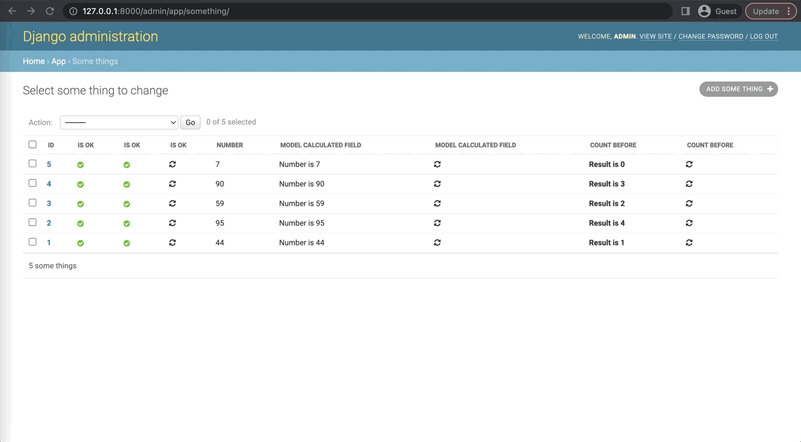

# django-admin-lazy-load 

Allows to speed-up loading of django admin page by deffering (lazy  loading) heavy calculated field  - via separate ajax requests.

Super-easy yet flexible set-up. 
Supports any kind of admin fields including:

* properties defined on model level
* properties defined in admin class

  Please see [example project](example_project/app/admin.py).



#  Install

1. `pip install django-admin-lazy-load`
2. Add `"admin_lazy_load"` to `INSTALLED_APPS`
3. Make sure `django.contrib.staticfiles.finders.AppDirectoriesFinder` is not disabled in your settings.
# Usage

```
from admin_lazy_load import LazyLoadAdminMixin

....

class YourModelAdmin(LazyLoadAdminMixin, ModelAdmin):
    ...
    lazy_loaded_fields = (
        'calculated_value'
    )
    list_display = (
        ...
        'calculated_value_lazy_click'
        ...
    )

    def calculated_value(self, obj):
        return ...

```
